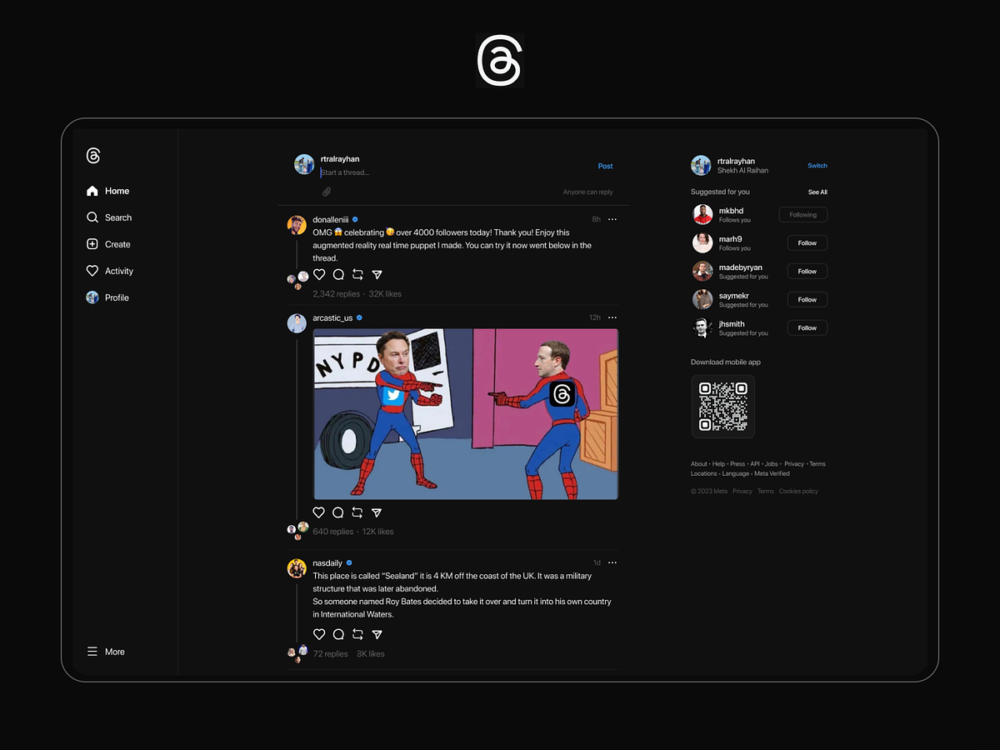

**Threads - Plataforma de Rede Social**


Threads é uma plataforma de rede social projetada para conectar pessoas, compartilhar pensamentos e participar de conversas significativas. Com uma interface amigável e foco na simplicidade, o Threads permite que você descubra e interaja com conteúdo de amigos, familiares e pessoas com interesses similares.

## Recursos

- **Autenticação de Usuário:** Crie uma conta ou faça login com segurança usando seu e-mail e senha. Mantenha seus dados pessoais protegidos com nossas medidas avançadas de segurança.

- **Compartilhamento de Publicações:** Compartilhe seus pensamentos, fotos e atualizações com seus seguidores. Personalize suas publicações com emojis para se expressar melhor.

- **Curtidas e Comentários:** Demonstre apreço por publicações que você gosta dando curtidas nelas. Participe de conversas através de comentários com outros usuários.

- **Feed de Exploração:** Descubra novos conteúdos e conecte-se com novas pessoas por meio do nosso feed de exploração.

- **Perfis de Usuários:** Personalize seu perfil com uma foto de perfil, foto de capa e uma breve biografia. Acompanhe suas publicações e seguidores.

## Tecnologias Utilizadas

- **Front-end:** React, React Bootstrap, Vite, SCSS
- **Back-end:** Firebase (Autenticação e Banco de Dados)

## Instalação

1. Clone o repositório: `git clone https://github.com/your-username/threads.git`
2. Navegue até o diretório do projeto: `cd threads`
3. Instale as dependências: `npm install`
4. Inicie o servidor de desenvolvimento: `npm run dev`

## Dependências

As seguintes dependências são utilizadas no projeto:

```json
"dependencies": {
  "bootstrap": "^5.3.1",
  "firebase": "^10.1.0",
  "node-sass": "^9.0.0",
  "react": "^18.2.0",
  "react-bootstrap": "^2.8.0",
  "react-dom": "^18.2.0",
  "react-firebase-hooks": "^5.1.1",
  "react-icons": "^4.10.1",
  "react-router-dom": "^6.14.2"
}
```

## Contribuição

Agradecemos contribuições da comunidade! Se você deseja contribuir para o Threads, siga os seguintes passos:

1. Faça um fork do repositório.
2. Crie um novo branch: `git checkout -b feature/nome-da-sua-feature`
3. Faça commit das suas alterações: `git commit -m "Adicionar sua feature"`
4. Faça push para o branch: `git push origin feature/nome-da-sua-feature`
5. Abra um pull request.

## Licença

Este projeto está licenciado sob a [Licença MIT](https://opensource.org/licenses/MIT).

## Contato

Se tiver alguma dúvida ou feedback, sinta-se à vontade para me contatar em [Daniel Filipe](https://www.facebook.com/profile.php?id=100050680572102).

<hr>

Quanto ao dono do [UI & UX](https://www.figma.com/community/file/1258765574014030329/Threads--by-Instagram-Web-Design-Dark-UI), [Shekh Al Raihan](https://dribbble.com/rtralrayhan), quero agradecer pela inspiração que você me proporcionou para criar o Threads. Seu trabalho me motivou a desenvolver uma plataforma que oferece uma experiência amigável, bonita e funcional aos nossos usuários.

Caso você deseje entrar em contato ou tenha algum feedback específico sobre o uso de suas ideias no Threads, ficarei feliz em ouvir suas sugestões e opiniões. Meu objetivo é sempre valorizar e respeitar a criatividade e o trabalho de outros profissionais, e estou aberto a qualquer discussão sobre o assunto.

Obrigado novamente por inspirar nosso projeto e nos permitir criar uma plataforma que esperamos que seja útil e apreciada por muitas pessoas! 🙌


Aproveite para se conectar e compartilhar com o Threads! 🎉
